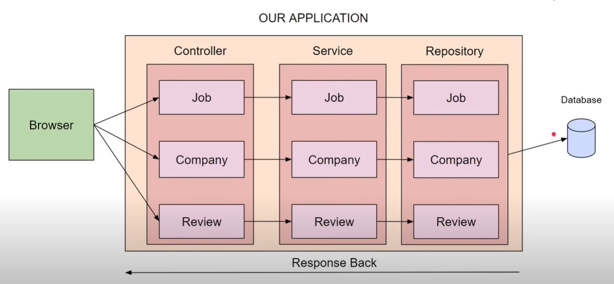

# SPRING JOBAPPLICATION

# Project Architecture


## Run Locally

Clone the project

```bash
  git clone https://github.com/FlowerC9/Spring_JobApplication.git
```

Go to the project directory

```bash
  install maven dependencies
```
Start the server

```bash
  Start using intellij or sts or eclipse or whatever are you using.now you will see a log that tomcat started on port 8080 then the sever is running successfully. 
```


